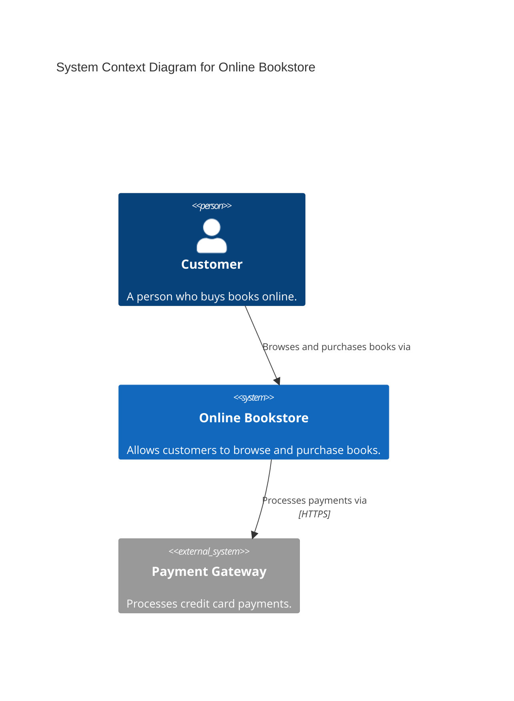
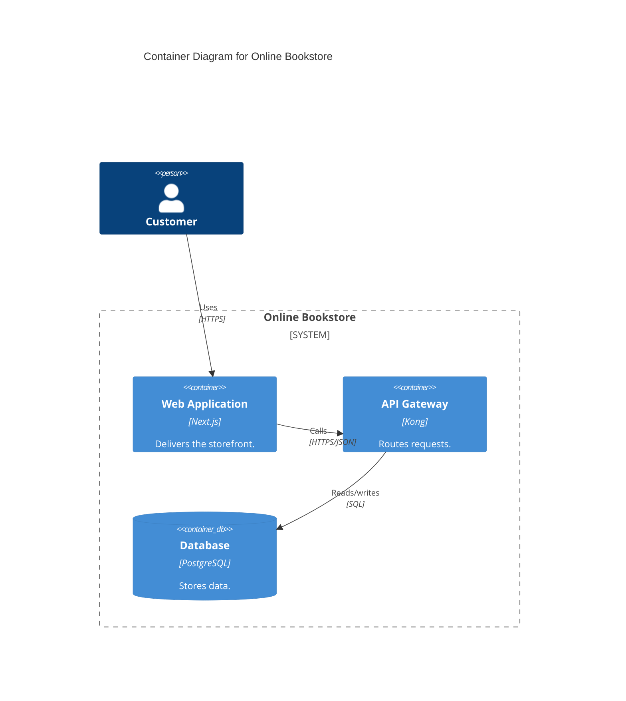

# C4 Model Diagrams

## Overview

The C4 model, created by Simon Brown, is a hierarchical approach to software architecture diagramming. It uses four levels of abstraction — Context, Container, Component, and Code — to describe a software system at different zoom levels. The primary tooling for C4 is the **Structurizr DSL**, a text-based domain-specific language purpose-built for C4 modeling.

## The Four Levels

### Level 1: System Context

The highest level of abstraction. Shows the system under consideration and its relationships with users (actors) and other systems. Answers: "What is the system and who uses it?"

```
workspace {
    model {
        user = person "User" "A customer of the system."
        email = softwareSystem "Email System" "Sends transactional emails." "External"
        system = softwareSystem "My System" "Handles core business logic."

        user -> system "Uses"
        system -> email "Sends emails via"
    }
    views {
        systemContext system "SystemContext" {
            include *
            autolayout lr
        }
    }
}
```

### Level 2: Container

Zooms into a single software system to show the high-level technology choices — web apps, APIs, databases, message brokers, etc. Answers: "What are the major technology building blocks?"

```
workspace {
    model {
        user = person "User"
        system = softwareSystem "My System" {
            webapp = container "Web Application" "Serves the UI." "React"
            api = container "API Service" "Handles business logic." "Node.js"
            db = container "Database" "Stores data." "PostgreSQL" "Database"
        }

        user -> webapp "Visits"
        webapp -> api "Calls" "HTTPS/JSON"
        api -> db "Reads from and writes to" "SQL/TCP"
    }
    views {
        container system "Containers" {
            include *
            autolayout lr
        }
    }
}
```

### Level 3: Component

Zooms into a single container to show the logical components inside it and their interactions. Answers: "What are the major structural building blocks inside a container?"

```
workspace {
    model {
        system = softwareSystem "My System" {
            api = container "API Service" {
                controller = component "API Controller" "Handles HTTP requests." "Express Router"
                service = component "Business Service" "Implements domain logic." "TypeScript Class"
                repo = component "Repository" "Data access layer." "TypeORM Repository"
            }
            db = container "Database" "PostgreSQL" "Database"

            controller -> service "Delegates to"
            service -> repo "Uses"
            repo -> db "Reads/writes" "SQL"
        }
    }
    views {
        component api "Components" {
            include *
            autolayout lr
        }
    }
}
```

### Level 4: Code

The lowest level. Shows the internal structure of a single component — typically a UML class diagram or similar. This level is usually auto-generated from code and is optional in most C4 workflows.

> **Note:** Level 4 is often omitted in practice because it can be generated directly from source code by IDEs or static analysis tools. Use it only when the internal structure of a component is complex enough to warrant explicit documentation.

## Structurizr DSL Reference

### Workspace Definition

Every Structurizr DSL file starts with a `workspace` block that contains a `model` and `views`.

```
workspace "Name" "Description" {
    !identifiers hierarchical

    model {
        // Define people, software systems, containers, components
    }

    views {
        // Define diagrams (views) of the model
    }
}
```

### Model Elements

| Element | Syntax | Description |
|---------|--------|-------------|
| Person | `person "Name" "Description" "Tag"` | A human user of the system |
| Software System | `softwareSystem "Name" "Description" "Tag"` | A top-level system |
| Container | `container "Name" "Description" "Technology" "Tag"` | A deployable unit inside a system |
| Component | `component "Name" "Description" "Technology" "Tag"` | A logical grouping inside a container |

### Relationships

```
source -> destination "Description" "Technology" "Tag"
```

Examples:
```
user -> system "Uses"
webapp -> api "Makes API calls to" "HTTPS/JSON"
api -> db "Reads from and writes to" "JDBC"
```

### Views

| View | Syntax | Shows |
|------|--------|-------|
| System Context | `systemContext <system> "key" { ... }` | Level 1 |
| Container | `container <system> "key" { ... }` | Level 2 |
| Component | `component <container> "key" { ... }` | Level 3 |
| Dynamic | `dynamic <scope> "key" { ... }` | Interaction sequences |
| Deployment | `deployment <system> <environment> "key" { ... }` | Infrastructure mapping |

### Styles

```
views {
    styles {
        element "Person" {
            shape Person
            background #08427B
            color #ffffff
        }
        element "Software System" {
            background #1168BD
            color #ffffff
        }
        element "Database" {
            shape Cylinder
        }
        element "External" {
            background #999999
        }
        relationship "Relationship" {
            thickness 2
            color #707070
            style dashed
        }
    }
}
```

### Available Shapes

`Box` (default), `RoundedBox`, `Circle`, `Ellipse`, `Hexagon`, `Cylinder`, `Pipe`, `Person`, `Robot`, `Folder`, `WebBrowser`, `MobileDevicePortrait`, `MobileDeviceLandscape`, `Component`

## Complete Workspace Example

```
workspace "Online Bookstore" "Architecture of the online bookstore system." {
    !identifiers hierarchical

    model {
        customer = person "Customer" "A person who buys books online."
        admin = person "Admin" "Internal staff managing the catalog."

        bookstore = softwareSystem "Online Bookstore" "Allows customers to browse and purchase books." {
            webapp = container "Web Application" "Delivers the storefront to customers." "Next.js" "WebBrowser"
            api = container "API Gateway" "Routes requests to microservices." "Kong"
            catalogService = container "Catalog Service" "Manages the book catalog." "Go" {
                catalogController = component "Catalog Controller" "Handles catalog HTTP endpoints." "net/http"
                catalogLogic = component "Catalog Logic" "Business rules for catalog management." "Go package"
                catalogRepo = component "Catalog Repository" "Reads/writes catalog data." "GORM"
            }
            orderService = container "Order Service" "Processes customer orders." "Java/Spring Boot"
            catalogDb = container "Catalog Database" "Stores book catalog data." "PostgreSQL" "Database"
            orderDb = container "Order Database" "Stores order data." "PostgreSQL" "Database"
            queue = container "Message Queue" "Asynchronous event processing." "RabbitMQ"
        }

        payments = softwareSystem "Payment Gateway" "Processes credit card payments." "External"

        # Relationships
        customer -> webapp "Browses and purchases books via"
        admin -> webapp "Manages catalog via"
        webapp -> api "Sends requests to" "HTTPS/JSON"
        api -> catalogService "Routes catalog requests to" "gRPC"
        api -> orderService "Routes order requests to" "gRPC"
        catalogService -> catalogDb "Reads from and writes to" "SQL/TCP"
        orderService -> orderDb "Reads from and writes to" "SQL/TCP"
        orderService -> queue "Publishes order events to" "AMQP"
        orderService -> payments "Processes payments via" "HTTPS"

        # Component-level relationships
        catalogController -> catalogLogic "Delegates to"
        catalogLogic -> catalogRepo "Uses"
        catalogRepo -> catalogDb "Queries" "SQL"
    }

    views {
        systemContext bookstore "Context" {
            include *
            autolayout lr
        }

        container bookstore "Containers" {
            include *
            autolayout lr
        }

        component catalogService "CatalogComponents" {
            include *
            autolayout lr
        }

        styles {
            element "Person" {
                shape Person
                background #08427B
                color #ffffff
            }
            element "Software System" {
                background #1168BD
                color #ffffff
            }
            element "Container" {
                background #438DD5
                color #ffffff
            }
            element "Component" {
                background #85BBF0
                color #000000
            }
            element "Database" {
                shape Cylinder
            }
            element "WebBrowser" {
                shape WebBrowser
            }
            element "External" {
                background #999999
                color #ffffff
            }
        }
    }
}
```

## Structurizr CLI Commands

```bash
# Validate a workspace DSL file
structurizr-cli validate -workspace workspace.dsl

# Push a workspace to Structurizr (cloud or on-premises)
structurizr-cli push -id <workspace-id> -key <api-key> -secret <api-secret> -workspace workspace.dsl

# Pull a workspace from Structurizr
structurizr-cli pull -id <workspace-id> -key <api-key> -secret <api-secret>

# Export diagrams to various formats
structurizr-cli export -workspace workspace.dsl -format plantuml
structurizr-cli export -workspace workspace.dsl -format mermaid
structurizr-cli export -workspace workspace.dsl -format json
structurizr-cli export -workspace workspace.dsl -format png

# Run Structurizr Lite locally (Docker)
docker run -it --rm -p 8080:8080 -v $(pwd):/usr/local/structurizr structurizr/lite
```

## Mermaid C4 Support

Mermaid supports C4 diagrams natively, making it possible to embed C4 models directly in Markdown rendered by GitHub, GitLab, and other platforms.





## Best Practices

- **Start at Level 1.** Always begin with a System Context diagram to define boundaries and external dependencies before zooming in.
- **Use hierarchical decomposition.** Each level should tell a coherent story at its abstraction level. Do not mix abstractions (e.g., do not show database tables in a Container diagram).
- **Name elements consistently.** Use the same name for an element across all levels so readers can trace from Context down to Component.
- **Limit detail per diagram.** Keep each diagram to 5-20 elements. If a diagram is too crowded, it means the container or component needs further decomposition.
- **Tag elements for styling.** Use tags like `"Database"`, `"External"`, `"WebBrowser"` to apply consistent visual styles.
- **Skip Level 4 unless necessary.** Code-level diagrams are better generated from source code. Reserve manual Level 4 diagrams for algorithmically complex components.
- **Version your DSL.** Store `workspace.dsl` in Git alongside the source code it describes. Treat it as a first-class artifact.
- **Use `autolayout`** to get consistent, automated positioning. Override with explicit positioning only when automatic layout produces poor results.
- **Add deployment views** for infrastructure mapping — they show how containers map to cloud services, VMs, or Kubernetes clusters.
- **Export to Mermaid** for embedding in Markdown documentation. Use the Structurizr CLI `export -format mermaid` command.
