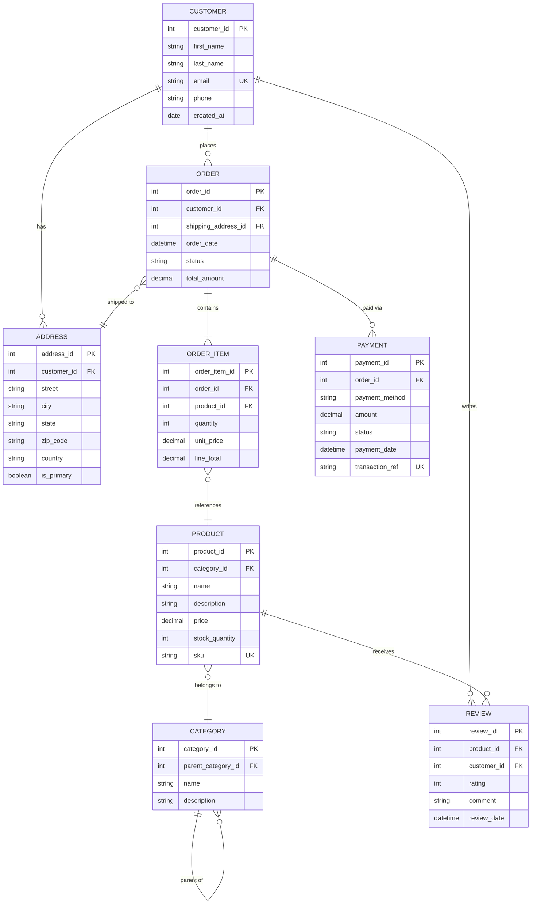

# Entity-Relationship Diagrams (ERD)

## Overview
Entity-Relationship Diagrams model the structure of data by defining entities, their attributes, and the relationships between them. ERDs are the foundational tool for database design, used from early conceptual modeling through to physical schema implementation.

ERDs operate at three levels of abstraction:
- **Conceptual ERD** — High-level entities and relationships, no attributes. Used for business communication.
- **Logical ERD** — Entities, attributes, primary keys, and relationships with cardinality. Database-agnostic.
- **Physical ERD** — Table names, column types, indexes, constraints. Maps directly to a specific DBMS.

## Entity Types

An entity represents a "thing" or concept about which data is stored.

| Entity Type | Description | Example |
|------------|-------------|---------|
| **Strong Entity** | Exists independently, has its own primary key | Customer, Product, Order |
| **Weak Entity** | Cannot exist without a related strong entity; uses a partial key combined with the owner's key | OrderLineItem (depends on Order), DependentPerson (depends on Employee) |
| **Associative Entity** | Resolves a many-to-many relationship into a table with its own attributes | Enrollment (between Student and Course, with grade attribute) |

## Attributes

Attributes describe properties of an entity.

| Attribute Type | Description | Notation |
|---------------|-------------|----------|
| **Primary Key (PK)** | Uniquely identifies each entity instance | Underlined or marked PK |
| **Foreign Key (FK)** | References a primary key in another entity | Marked FK |
| **Required (NOT NULL)** | Must have a value for every instance | Typically no special mark (default) |
| **Nullable** | May have no value | Marked with optional indicator or (NULL) |
| **Composite** | Made up of multiple sub-attributes | e.g., Address = Street + City + State + Zip |
| **Derived** | Computed from other attributes | e.g., Age derived from BirthDate, shown with dashed oval or / prefix |
| **Multi-valued** | Can hold multiple values for one entity | e.g., PhoneNumbers (modeled as a separate table in relational design) |

## Relationships

Relationships connect entities and describe how they are associated.

### Relationship Types

| Type | Description | Example |
|------|-------------|---------|
| **One-to-One (1:1)** | Each instance of A is associated with exactly one instance of B | Person 1:1 Passport |
| **One-to-Many (1:N)** | Each instance of A is associated with zero or more instances of B | Customer 1:N Order |
| **Many-to-Many (M:N)** | Each instance of A can be associated with many instances of B and vice versa | Student M:N Course |

### Participation (Optionality)

| Participation | Description | Notation |
|--------------|-------------|----------|
| **Mandatory (Total)** | Every entity instance must participate in the relationship | Double line (Chen) or bar (Crow's Foot) |
| **Optional (Partial)** | An entity instance may or may not participate | Single line (Chen) or circle (Crow's Foot) |

### Cardinality and Participation Combined

```
Cardinality:     Minimum .. Maximum

Examples:
  0..1    Zero or one (optional, at most one)
  1..1    Exactly one (mandatory, at most one)
  0..*    Zero or many (optional, unbounded)
  1..*    One or many (mandatory, at least one)
```

## Chen Notation

Chen notation (original ER notation by Peter Chen, 1976) uses geometric shapes:

```
┌───────────┐          ┌──────────────┐         ┌───────────┐
│           │          │              │         │           │
│ CUSTOMER  │══════════◇   places     ◇════════│  ORDER    │
│           │  1       │              │   N     │           │
└─────┬─────┘          └──────────────┘         └─────┬─────┘
      │                                               │
   ┌──┴──┐                                        ┌──┴──┐
   │Name │                                        │Date │
   └─────┘                                        └─────┘
  (attribute)                                    (attribute)

   ┌─────────┐
   │_CustID_ │   ← underlined = Primary Key
   └─────────┘

Shapes:
  Rectangle     = Entity
  Diamond       = Relationship
  Oval          = Attribute
  Double rect   = Weak Entity
  Double diamond= Identifying Relationship (for weak entities)
  Double oval   = Multi-valued Attribute
  Dashed oval   = Derived Attribute
```

### Chen Notation Cardinality
- Numbers (1, N, M) are placed on the lines connecting entities to the relationship diamond
- Double lines indicate total (mandatory) participation
- Single lines indicate partial (optional) participation

## Crow's Foot Notation

Crow's Foot notation (also called IE notation or Martin notation) is the most widely used notation in database tools and is more compact than Chen notation.

### Crow's Foot Symbols

```
Cardinality Symbols (at the end of relationship lines):

    ──────||    Exactly one (mandatory one)
    ──────|O    Zero or one (optional one)
    ──────|<    One or many (mandatory many)
    ──────O<    Zero or many (optional many)

Where:
    ||  = "one and only one" (two bars)
    |O  = "zero or one" (bar + circle)
    |<  = "one or many" (bar + crow's foot)
    O<  = "zero or many" (circle + crow's foot)
```

### Crow's Foot Reading Convention

Read relationships from each entity's perspective:

```
┌──────────┐                      ┌──────────┐
│ CUSTOMER │ ──────||────────O< ──│  ORDER   │
└──────────┘                      └──────────┘

Reading left-to-right:
  "A CUSTOMER places zero or many ORDERs"

Reading right-to-left:
  "An ORDER is placed by exactly one CUSTOMER"
```

### Crow's Foot Full Example

```
┌──────────────┐         ┌──────────────┐         ┌──────────────┐
│  CUSTOMER    │         │   ORDER      │         │  PRODUCT     │
├──────────────┤         ├──────────────┤         ├──────────────┤
│ PK CustomerID│──||──O<─│ PK OrderID   │         │ PK ProductID │
│    Name      │         │ FK CustomerID│   ┌─O<──│    Name      │
│    Email     │         │    OrderDate │   │     │    Price     │
│    Phone     │         │    Total     │   │     │    Category  │
└──────────────┘         └──────┬───────┘   │     └──────────────┘
                                │           │
                         ┌──────┴───────┐   │
                         │ ORDER_ITEM   │   │
                         ├──────────────┤   │
                         │ PK,FK OrderID│──||┘
                         │ PK,FK ProdID │
                         │    Quantity  │
                         │    UnitPrice │
                         └──────────────┘

Resolves the M:N between ORDER and PRODUCT
via the associative entity ORDER_ITEM.
```

## Chen vs Crow's Foot Comparison

| Aspect | Chen Notation | Crow's Foot Notation |
|--------|--------------|---------------------|
| **Origin** | Peter Chen, 1976 | James Martin / Clive Finkelstein |
| **Shapes** | Rectangles, diamonds, ovals | Rectangles with line-end symbols |
| **Readability** | More explicit, good for teaching | More compact, good for production schemas |
| **Attributes** | Shown as ovals connected to entities | Listed inside entity rectangles |
| **Relationships** | Named diamond between entities | Named line between entities |
| **Cardinality** | Numbers on lines (1, N, M) | Symbols on line ends (crow's foot, bar, circle) |
| **Tool support** | Academic, some modeling tools | Most database tools (ERwin, MySQL Workbench, dbdiagram.io, Mermaid) |
| **Best for** | Conceptual modeling, teaching | Logical and physical modeling, implementation |

## Mermaid ERD Syntax

Mermaid provides native support for ER diagrams using Crow's Foot-style notation.

### Relationship Symbols

| Symbol | Meaning |
|--------|---------|
| `\|\|` | Exactly one |
| `o\|` | Zero or one |
| `\|{` | One or many |
| `o{` | Zero or many |

Relationships are written as: `EntityA <relationship> EntityB : "label"`

### Attribute Types

Mermaid ERD attributes support type, name, and constraint markers:

```
erDiagram
    ENTITY {
        type attribute_name PK "comment"
        type attribute_name FK
        type attribute_name UK "unique key"
    }
```

### Complete Mermaid ERD Example: E-Commerce Database



### Mermaid ERD Relationship Syntax Reference

```
erDiagram
    %% One-to-one (both mandatory)
    PERSON ||--|| PASSPORT : "holds"

    %% One-to-many (mandatory on both sides)
    DEPARTMENT ||--|{ EMPLOYEE : "employs"

    %% One-to-many (optional on many side)
    CUSTOMER ||--o{ ORDER : "places"

    %% Many-to-many (resolved via junction table)
    STUDENT }o--o{ COURSE : "enrolls in"

    %% One-to-zero-or-one
    EMPLOYEE ||--o| PARKING_SPOT : "assigned"
```

## Normalization

Normalization is the process of organizing data to reduce redundancy and improve integrity. Each normal form builds on the previous one.

### First Normal Form (1NF)
**Rule:** Every column contains only atomic (indivisible) values. No repeating groups or arrays.

**Violation:**
```
| OrderID | Products              |
|---------|----------------------|
| 1       | Widget, Gadget, Bolt |
```

**1NF Corrected:**
```
| OrderID | Product |
|---------|---------|
| 1       | Widget  |
| 1       | Gadget  |
| 1       | Bolt    |
```

### Second Normal Form (2NF)
**Rule:** Must be in 1NF, and every non-key attribute must depend on the entire primary key (no partial dependencies).

**Violation (composite key: OrderID + ProductID):**
```
| OrderID | ProductID | ProductName | Quantity |
|---------|-----------|-------------|----------|
| 1       | 101       | Widget      | 5        |
```
`ProductName` depends only on `ProductID`, not on the full key.

**2NF Corrected:**
```
ORDER_ITEM:  | OrderID | ProductID | Quantity |
PRODUCT:     | ProductID | ProductName |
```

### Third Normal Form (3NF)
**Rule:** Must be in 2NF, and no non-key attribute depends on another non-key attribute (no transitive dependencies).

**Violation:**
```
| EmployeeID | DepartmentID | DepartmentName |
|------------|-------------|----------------|
| 1          | 10          | Engineering    |
```
`DepartmentName` depends on `DepartmentID`, not on `EmployeeID`.

**3NF Corrected:**
```
EMPLOYEE:    | EmployeeID | DepartmentID |
DEPARTMENT:  | DepartmentID | DepartmentName |
```

### Summary of Normal Forms

| Normal Form | Eliminates | Rule |
|------------|------------|------|
| **1NF** | Repeating groups, multi-valued columns | All values are atomic |
| **2NF** | Partial dependencies | Non-key attributes depend on the whole key |
| **3NF** | Transitive dependencies | Non-key attributes depend only on the key |
| **BCNF** | Remaining anomalies from candidate keys | Every determinant is a candidate key |

### When to Denormalize

Denormalization intentionally reintroduces redundancy for performance or simplicity:

| Scenario | Justification |
|----------|--------------|
| **Read-heavy workloads** | Joins are expensive; pre-computed columns or materialized views reduce query time |
| **Reporting tables** | Star/snowflake schemas for data warehouses are intentionally denormalized |
| **Caching hot data** | Storing a copy of frequently accessed data in a denormalized form |
| **Reducing join complexity** | When a query always needs data from 5+ tables, strategic denormalization simplifies access |
| **Document databases** | NoSQL stores like MongoDB embed related data in a single document by design |

**Denormalization trade-offs:**
- Faster reads, slower writes
- Increased storage, reduced query complexity
- Risk of data inconsistency without proper update discipline

## Design Process

A recommended workflow for database design using ERDs:

```
1. Identify Entities
   │  What are the core "things" the system manages?
   ▼
2. Define Attributes
   │  What properties describe each entity? Identify PKs.
   ▼
3. Identify Relationships
   │  How are entities related? Determine cardinality.
   ▼
4. Draw Conceptual ERD
   │  Entities and relationships only, no attributes.
   ▼
5. Refine to Logical ERD
   │  Add attributes, PKs, FKs, resolve M:N via junction tables.
   ▼
6. Normalize (1NF → 2NF → 3NF)
   │  Eliminate redundancy and anomalies.
   ▼
7. Denormalize Selectively
   │  Add calculated columns or merge tables for performance.
   ▼
8. Create Physical ERD
   │  Specify data types, indexes, constraints for target DBMS.
```

## Best Practices
- **Start with a conceptual ERD.** Identify entities and relationships before worrying about attributes, types, or keys. Get agreement on the conceptual model first.
- **Normalize to 3NF by default.** Denormalize only when you have a measured performance problem. Premature denormalization causes data integrity issues.
- **Use Crow's Foot notation for implementation.** It is the most widely supported notation in database tools and maps directly to physical schemas.
- **Use Chen notation for teaching and conceptual design.** Its explicit shapes make it easier to explain ER concepts to non-technical stakeholders.
- **Resolve many-to-many relationships.** Every M:N relationship must be resolved into two 1:N relationships via an associative (junction) entity before physical implementation.
- **Name entities as singular nouns.** Use `CUSTOMER` not `CUSTOMERS`. The entity represents the concept, not a collection.
- **Name relationships with verbs.** "places", "contains", "belongs to" — not "has" (which is vague) or "link" (which is meaningless).
- **Mark all keys explicitly.** Every entity must have a PK. Every relationship should be traceable through FKs. Mark nullable vs required for each attribute.
- **Document cardinality from both directions.** "A CUSTOMER places zero or many ORDERs" AND "An ORDER is placed by exactly one CUSTOMER." Both sides matter.
- **Use Mermaid for ERDs in documentation.** Mermaid ERD syntax renders natively on GitHub, GitLab, and most documentation platforms, keeping your data models version-controlled alongside code.
- **Validate with sample data.** After drawing an ERD, populate it with 3-5 rows of realistic sample data per entity. This quickly reveals modeling errors.
- **Separate read models from write models.** In CQRS or event-sourced systems, the write-side schema should be normalized, while the read-side can be denormalized for query performance.
