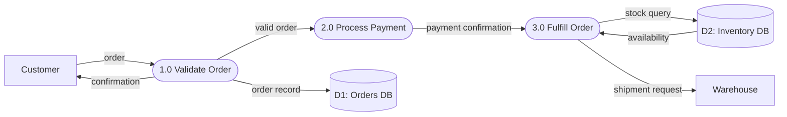
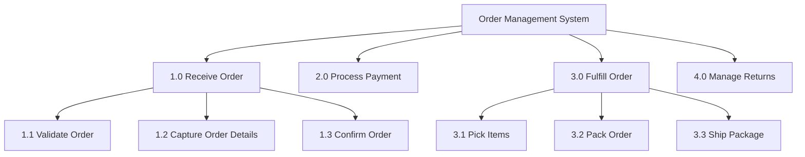
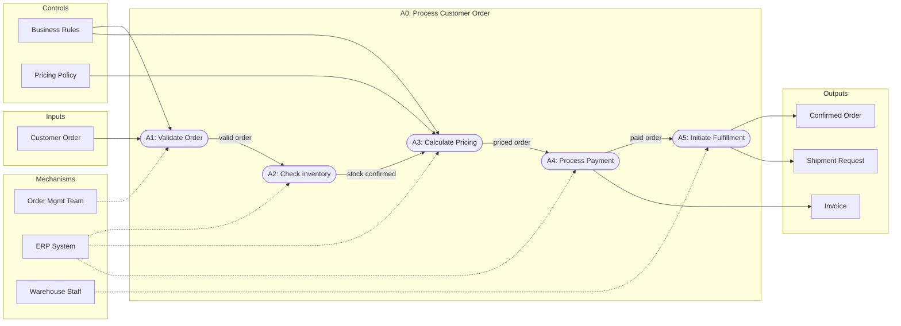
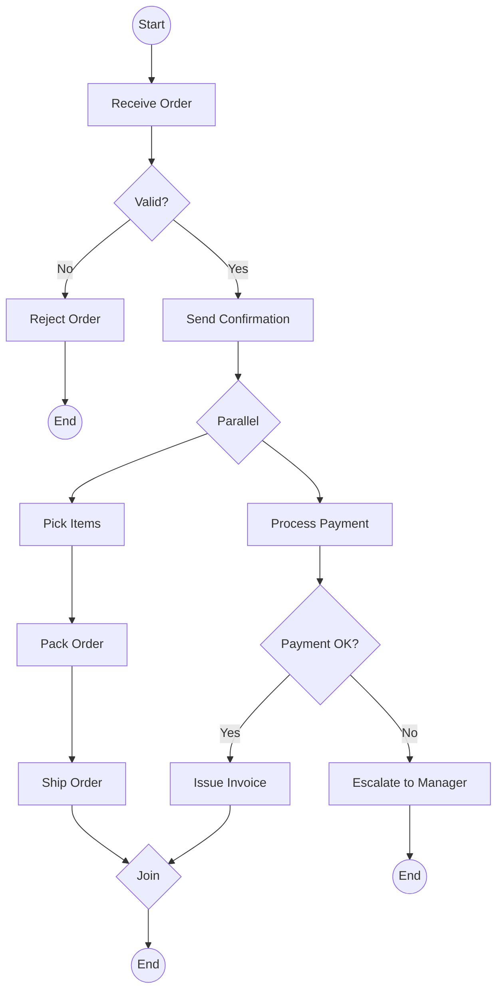

# Functional Diagrams

## Overview
Functional diagrams describe systems in terms of processes, data flows, and transformations rather than objects or containers. They answer the question "what does the system do with data?" and "how are functions decomposed into sub-functions?"

This skill covers four complementary functional diagramming techniques:
1. **Data Flow Diagrams (DFD)** — Show how data moves through a system
2. **Functional Decomposition** — Break high-level functions into sub-functions
3. **IDEF0** — Model decisions, actions, and activities with inputs, controls, outputs, and mechanisms
4. **BPMN** — Model business processes with standardized notation

## Data Flow Diagrams (DFD)

DFDs show how data is processed by a system. They use four core element types and are organized into hierarchical levels.

### DFD Elements

| Element | Symbol | Description |
|---------|--------|-------------|
| **Process** | Circle or rounded rectangle | Transforms input data into output data |
| **Data Store** | Open-ended rectangle (parallel lines) | Repository where data is held for later use |
| **External Entity** | Rectangle (square) | Source or sink of data outside the system boundary |
| **Data Flow** | Arrow with label | Movement of data between elements |

### DFD Levels

DFDs are organized hierarchically, with each level providing more detail:

```
┌─────────────────────────────────────────────────────────┐
│ Context Diagram (Level -1)                               │
│                                                          │
│  ┌──────────┐    order     ┌──────────┐   receipt       │
│  │ Customer  │────────────►│  Order    │──────────►      │
│  │ (External)│◄────────────│  System   │   ┌──────────┐ │
│  └──────────┘  confirmation│ (Process) │──►│ Warehouse│ │
│                             └──────────┘   │ (External)│ │
│                                            └──────────┘ │
│  Shows: entire system as ONE process                     │
└─────────────────────────────────────────────────────────┘

┌─────────────────────────────────────────────────────────┐
│ Level 0 Diagram                                          │
│                                                          │
│  ┌──────────┐  order   ┌─────────┐  valid   ┌────────┐ │
│  │ Customer  │────────►│ 1.0     │  order   │ 2.0    │ │
│  │           │         │ Validate │────────►│ Process │ │
│  └──────────┘         │ Order   │         │ Payment │ │
│                        └─────────┘         └───┬────┘ │
│                             │                   │      │
│                        error│              payment     │
│                             ▼              info │      │
│                        ┌─────────┐              ▼      │
│                        │ D1:     │         ┌────────┐ │
│                        │ Error   │         │ 3.0    │ │
│                        │ Log     │         │ Fulfill │ │
│                        └─────────┘         │ Order  │ │
│                                            └───┬────┘ │
│  Shows: major processes within the system       │      │
│                                           shipment    │
│                                            info │      │
│                                                 ▼      │
│                                           ┌──────────┐ │
│                                           │ Warehouse│ │
│                                           └──────────┘ │
└─────────────────────────────────────────────────────────┘

┌─────────────────────────────────────────────────────────┐
│ Level 1+ Diagrams                                        │
│                                                          │
│  Explodes a single Level 0 process into sub-processes.   │
│  E.g., "1.0 Validate Order" becomes:                     │
│                                                          │
│  ┌─────────┐ order  ┌─────────┐ checked  ┌─────────┐   │
│  │ 1.1     │───────►│ 1.2     │────────►│ 1.3     │   │
│  │ Check   │        │ Verify  │          │ Confirm │   │
│  │ Syntax  │        │ Stock   │          │ Price   │   │
│  └─────────┘        └────┬────┘          └─────────┘   │
│                          │                              │
│                     ┌────▼────┐                          │
│                     │ D2:     │                          │
│                     │ Inventory│                          │
│                     │ DB       │                          │
│                     └─────────┘                          │
└─────────────────────────────────────────────────────────┘
```

### DFD Rules
1. **All data flows must be labeled.** Unlabeled arrows are ambiguous.
2. **No data flow between two external entities.** The diagram models the system, not the outside world.
3. **No data flow between two data stores.** Data movement requires a process.
4. **Every process must have at least one input and one output.** A process with no inputs is a "miracle"; a process with no outputs is a "black hole."
5. **Data stores must connect to processes, not external entities.** External entities interact through processes.
6. **Level numbers must be consistent.** Sub-processes of Process 1.0 are 1.1, 1.2, 1.3, etc.

### DFD in Mermaid Syntax

Mermaid does not have native DFD support, but flowchart syntax can represent DFD concepts:



## Functional Decomposition

Functional decomposition breaks a system into hierarchical sub-functions. Each level reveals more detail about how a function is accomplished.

### Decomposition Tree Structure

```
┌──────────────────────────────────────────┐
│         Order Management System           │
│              (Level 0)                    │
└──────────────┬───────────────────────────┘
               │
    ┌──────────┼──────────────┬─────────────────┐
    │          │              │                  │
    ▼          ▼              ▼                  ▼
┌────────┐ ┌────────┐  ┌──────────┐      ┌──────────┐
│ Receive│ │ Process│  │ Fulfill  │      │ Manage   │
│ Order  │ │ Payment│  │ Order    │      │ Returns  │
│ (1.0)  │ │ (2.0)  │  │ (3.0)   │      │ (4.0)    │
└───┬────┘ └───┬────┘  └────┬─────┘      └────┬─────┘
    │          │             │                  │
  ┌─┼─┐     ┌─┼─┐       ┌──┼──┐           ┌──┼──┐
  ▼ ▼ ▼     ▼ ▼ ▼       ▼  ▼  ▼           ▼  ▼  ▼
1.1 1.2    2.1 2.2     3.1 3.2 3.3       4.1 4.2 4.3
Val Cap    Auth Rec    Pick Pack Ship    Auth Proc Ref
```

### Decomposition Guidelines
- **Stop decomposing** when a function is simple enough to be implemented as a single unit of work.
- **Each parent function** should decompose into 2-7 child functions. Too few suggests unnecessary hierarchy; too many suggests the parent is not well-defined.
- **Naming convention:** Use verb-noun pairs (e.g., "Validate Order", "Process Payment", "Ship Package").
- **Maintain consistency:** All children at the same level should be at the same granularity.

### Functional Decomposition in Mermaid



## IDEF0 (Integration Definition for Function Modeling)

IDEF0 models functions (activities, processes, operations) and the data/objects that inter-relate those functions. Each function is represented as a box with four types of arrows.

### ICOM Convention

```
        Controls (top)
            │
            ▼
    ┌───────────────┐
    │               │
Inputs ──►│   Function    │──► Outputs
(left)    │               │    (right)
    └───────┬───────┘
            │
            ▲
        Mechanisms (bottom)
```

| Arrow Position | Name | Description | Example |
|---------------|------|-------------|---------|
| **Left** (entering) | Inputs | Data or objects transformed by the function | Raw order data |
| **Top** (entering) | Controls | Conditions, rules, or constraints that govern the function | Business rules, regulations |
| **Right** (exiting) | Outputs | Data or objects produced by the function | Validated order |
| **Bottom** (entering) | Mechanisms | Resources that perform the function | Staff, software, equipment |

### IDEF0 Example: Process Customer Order

```
              Business Rules     Pricing Policy
                   │                  │
                   ▼                  ▼
              ┌──────────────────────────────┐
              │                              │
Customer  ──►│    Process Customer Order     │──► Confirmed Order
Order         │          (A0)                │──► Invoice
              │                              │──► Shipment Request
              └──────────────┬───────────────┘
                             │
                  ┌──────────┼──────────┐
                  ▲          ▲          ▲
              Order Mgmt   ERP       Warehouse
              Team        System     Staff
```

### IDEF0 Decomposition

Like DFDs, IDEF0 diagrams decompose hierarchically:
- **A-0:** Top-level context diagram (single box)
- **A0:** First decomposition (3-6 child functions)
- **A1, A2, ...:** Further decomposition of each function

```
A-0: Process Customer Order
 └── A0 Decomposition:
      ├── A1: Validate Order
      ├── A2: Check Inventory
      ├── A3: Calculate Pricing
      ├── A4: Process Payment
      └── A5: Initiate Fulfillment
```

### IDEF0 Rules
1. **Each function box must have at least one control and one output.** Inputs and mechanisms may be optional.
2. **3-6 functions per diagram.** Too few does not add value; too many becomes unreadable.
3. **Arrows between boxes model data/object flow.** An output of one function can become the input or control of another.
4. **Boundary arrows** connect to parent diagram arrows via ICOM codes.
5. **Node numbering:** A0 decomposes to A1-A6; A1 decomposes to A11-A16; etc.

### IDEF0 in Mermaid



## BPMN (Business Process Model and Notation)

BPMN is an ISO standard (ISO/IEC 19510) for graphically representing business processes. It is the most widely used process modeling notation.

### Core BPMN Elements

#### Flow Objects

| Element | Symbol | Description |
|---------|--------|-------------|
| **Task** | Rounded rectangle | An atomic activity within a process |
| **Sub-Process** | Rounded rectangle with + | A compound activity containing a nested process |
| **Event (Start)** | Thin circle | Indicates where a process begins |
| **Event (Intermediate)** | Double circle | Occurs between start and end |
| **Event (End)** | Thick circle | Indicates where a process ends |
| **Exclusive Gateway (XOR)** | Diamond with X | Decision point, only one path taken |
| **Parallel Gateway (AND)** | Diamond with + | All paths are taken simultaneously |
| **Inclusive Gateway (OR)** | Diamond with O | One or more paths taken |
| **Event-Based Gateway** | Diamond with pentagon | Path determined by event occurrence |

#### Swimlane Elements

| Element | Description |
|---------|-------------|
| **Pool** | A container representing a participant (organization, system, role) |
| **Lane** | A sub-partition within a pool, typically representing a specific role or department |

#### Connecting Objects

| Element | Description |
|---------|-------------|
| **Sequence Flow** | Solid arrow showing order of activities within a pool |
| **Message Flow** | Dashed arrow showing communication between pools |
| **Association** | Dotted line connecting data objects or annotations to flow objects |

#### Data Elements

| Element | Description |
|---------|-------------|
| **Data Object** | Information required or produced by a task |
| **Data Store** | A persistent repository |

### BPMN Example: Order Fulfillment Process

```
┌──────────────────────────────────────────────────────────────────────┐
│ Pool: Order Fulfillment                                               │
│                                                                       │
│ ┌─────────────────────────────────────────────────────────────────┐  │
│ │ Lane: Sales                                                      │  │
│ │                                                                  │  │
│ │  (○)──►[Receive Order]──►<X>──►[Send Confirmation]──►           │  │
│ │  Start                   │                                       │  │
│ │                     invalid                                      │  │
│ │                          │                                       │  │
│ │                          ▼                                       │  │
│ │                   [Reject Order]──►(●)                           │  │
│ │                                   End                            │  │
│ └──────────────────────────────────┼──────────────────────────────┘  │
│                                     │ valid                          │
│ ┌──────────────────────────────────▼──────────────────────────────┐  │
│ │ Lane: Warehouse                                                  │  │
│ │                                                                  │  │
│ │  [Pick Items]──►[Pack Order]──►[Ship Order]──►(●)               │  │
│ │                                                End               │  │
│ └──────────────────────────────────────────────────────────────────┘  │
│                                                                       │
│ ┌──────────────────────────────────────────────────────────────────┐  │
│ │ Lane: Finance                                                    │  │
│ │                                                                  │  │
│ │  [Process Payment]──►<X>──►[Issue Invoice]──►(●)                │  │
│ │                       │                      End                 │  │
│ │                  failed│                                          │  │
│ │                       ▼                                          │  │
│ │                [Escalate to Manager]──►(●)                       │  │
│ │                                       End                        │  │
│ └──────────────────────────────────────────────────────────────────┘  │
└──────────────────────────────────────────────────────────────────────┘

Legend: (○) = Start Event, (●) = End Event, <X> = Exclusive Gateway
        [Task] = Task/Activity
```

### BPMN in Mermaid

Mermaid does not have native BPMN support, but flowchart syntax can approximate BPMN processes:



## Choosing the Right Functional Diagram

| Diagram Type | Best For | Not Suitable For |
|-------------|----------|-----------------|
| **DFD** | Data transformation analysis, system boundaries, data store identification | Process timing, organizational roles |
| **Functional Decomposition** | Breaking complex systems into manageable pieces, scope definition | Data flow, process sequencing |
| **IDEF0** | Understanding function constraints and resources, manufacturing and engineering processes | Simple workflows, quick communication |
| **BPMN** | Business process documentation, workflow automation, cross-department handoffs | Data modeling, system architecture |

## Combining Functional Diagram Types

These diagram types are complementary:

```
Functional Decomposition Tree
    │
    │ identifies functions to model
    ▼
IDEF0 Diagrams
    │
    │ identifies data transformations
    ▼
Data Flow Diagrams
    │
    │ identifies processes to orchestrate
    ▼
BPMN Process Models
```

1. **Start with Functional Decomposition** to identify the major functions of the system.
2. **Use IDEF0** to understand the inputs, outputs, controls, and mechanisms of critical functions.
3. **Create DFDs** to trace how data moves through and between the functions.
4. **Model in BPMN** when the focus shifts to implementing business processes with specific roles and decision logic.

## Best Practices
- **Start at the context level.** Whether using DFD or IDEF0, begin with a single-process context diagram before decomposing. This establishes scope and boundaries.
- **Maintain level consistency.** All processes at the same decomposition level should be at the same granularity. Do not mix high-level and detailed processes on the same diagram.
- **Label every data flow.** Unlabeled arrows are the most common DFD error and make diagrams ambiguous.
- **Limit elements per diagram.** Follow the 3-7 process guideline per decomposition level. More than 7 processes on a single diagram reduces readability.
- **Use verb-noun naming for processes.** "Validate Order", "Calculate Tax", "Ship Package" — not "Order Validation" or "Tax Module."
- **Distinguish between data flow and control flow.** In DFDs, arrows represent data movement. In BPMN, arrows represent sequence flow. Do not mix paradigms on a single diagram.
- **Validate data conservation.** All data entering a process must either be output or stored. Data does not appear or disappear inside processes.
- **Use BPMN pools for organizational boundaries.** Each pool represents a distinct participant. Use lanes within pools for roles or departments.
- **Use Mermaid flowcharts as a practical approximation.** While Mermaid does not natively support DFD or IDEF0 notation, flowchart syntax captures the essential structure and is renderable in documentation platforms.
- **Cross-reference between diagram types.** When using both DFDs and BPMN, ensure process names and data labels are consistent across all diagrams. A process called "Validate Order" in the DFD should have the same name in the BPMN model.
