# Mermaid.js

## Overview

Mermaid.js is a JavaScript-based text-to-diagram tool that renders diagrams from Markdown-like syntax. It is the de facto standard for embedding diagrams in Markdown because GitHub, GitLab, Azure DevOps, Notion, Docusaurus, and many other platforms render Mermaid code blocks natively. You write text; the platform renders a diagram.

## Supported Diagram Types

| Diagram | Keyword | Purpose |
|---------|---------|---------|
| Flowchart | `flowchart` or `graph` | Process flows, decision trees, workflows |
| Sequence | `sequenceDiagram` | Interaction order between participants |
| Class | `classDiagram` | Object-oriented structure and relationships |
| State | `stateDiagram-v2` | State machine transitions |
| Entity Relationship | `erDiagram` | Data model relationships |
| Gantt | `gantt` | Project scheduling and timelines |
| Pie | `pie` | Proportional data |
| Mindmap | `mindmap` | Hierarchical idea mapping |
| Timeline | `timeline` | Chronological events |
| Quadrant | `quadrantChart` | 2x2 categorization matrix |
| C4 Context | `C4Context` | C4 Level 1 diagrams |
| C4 Container | `C4Container` | C4 Level 2 diagrams |
| Git Graph | `gitGraph` | Branch and commit visualization |

## Flowchart

The most commonly used diagram type. Supports directional layouts, shape types, subgraphs, and link styles.

### Directions

| Direction | Meaning |
|-----------|---------|
| `TB` or `TD` | Top to Bottom |
| `BT` | Bottom to Top |
| `LR` | Left to Right |
| `RL` | Right to Left |

### Node Shapes

| Syntax | Shape |
|--------|-------|
| `A[Text]` | Rectangle |
| `A(Text)` | Rounded rectangle |
| `A([Text])` | Stadium / pill |
| `A{Text}` | Diamond (decision) |
| `A{{Text}}` | Hexagon |
| `A[[Text]]` | Subroutine |
| `A[(Text)]` | Cylinder (database) |
| `A((Text))` | Circle |
| `A>Text]` | Asymmetric / flag |

### Full Example

````markdown
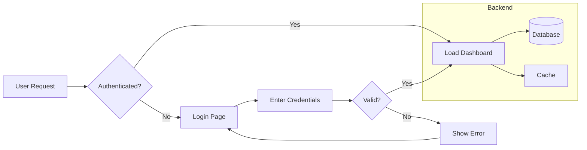
````

### Link Types

| Syntax | Type |
|--------|------|
| `-->` | Arrow |
| `---` | Line (no arrow) |
| `-.->` | Dotted arrow |
| `==>` | Thick arrow |
| `--text-->` | Arrow with label |
| `-.text.->` | Dotted arrow with label |

## Sequence Diagram

Shows the order of interactions between participants over time.

````markdown
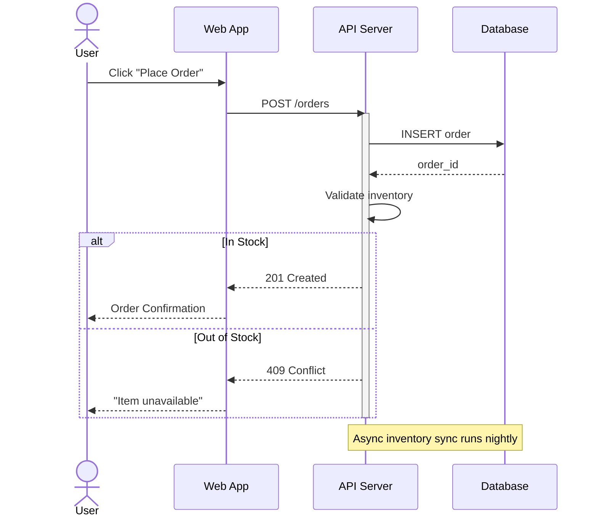
````

### Arrow Types

| Syntax | Meaning |
|--------|---------|
| `->>` | Solid arrow (synchronous) |
| `-->>` | Dashed arrow (response / async) |
| `-x` | Solid with cross (lost message) |
| `--x` | Dashed with cross |
| `-)` | Solid open arrow (async fire-and-forget) |
| `--)` | Dashed open arrow |

### Features

- `activate` / `deactivate` for activation bars
- `alt` / `else` / `end` for conditional logic
- `loop` / `end` for repetition
- `par` / `and` / `end` for parallel processing
- `critical` / `option` / `end` for critical regions
- `Note over A,B: text` for annotations
- `rect rgb(...)` for background highlighting

## Class Diagram

Models object-oriented structure with classes, interfaces, relationships, and visibility.

````markdown
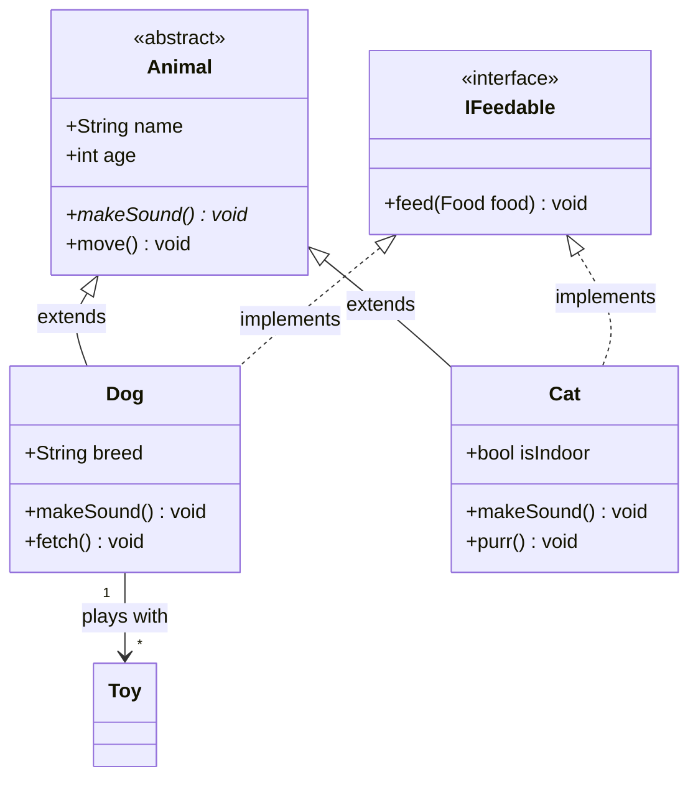
````

### Visibility Modifiers

| Symbol | Meaning |
|--------|---------|
| `+` | Public |
| `-` | Private |
| `#` | Protected |
| `~` | Package/Internal |

### Relationship Types

| Syntax | Meaning |
|--------|---------|
| `<\|--` | Inheritance |
| `<\|..` | Implementation (interface) |
| `*--` | Composition |
| `o--` | Aggregation |
| `-->` | Association |
| `..>` | Dependency |
| `--` | Link (solid) |
| `..` | Link (dashed) |

## State Diagram

Models state machine transitions.

````markdown
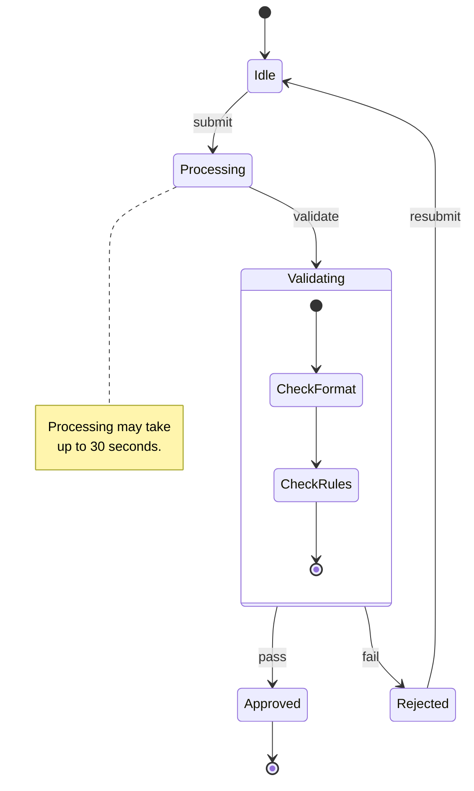
````

## Entity Relationship Diagram

Models data relationships with cardinality.

````markdown
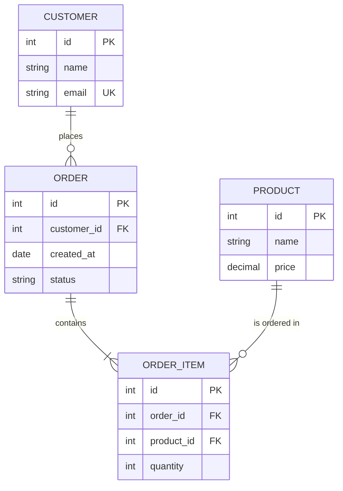
````

### Cardinality Notation

| Syntax | Meaning |
|--------|---------|
| `\|\|` | Exactly one |
| `o\|` | Zero or one |
| `}o` | Zero or many |
| `}\|` | One or many |

## Gantt Chart

````markdown
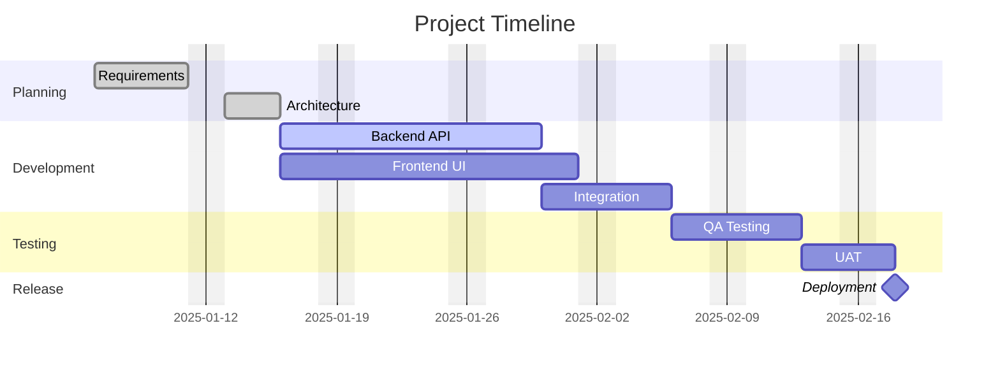
````

## Pie Chart

````markdown
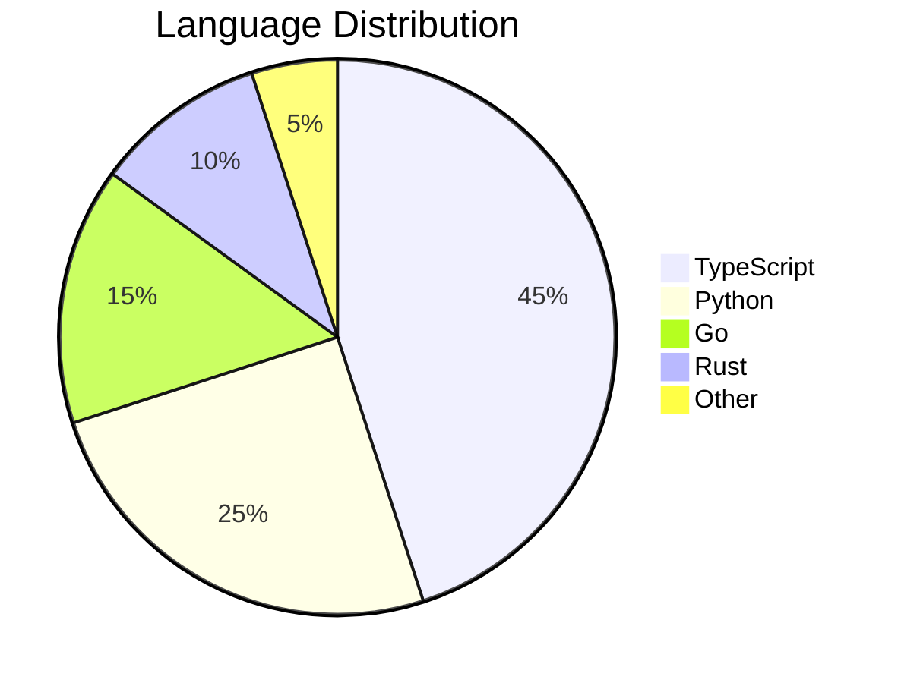
````

## Mindmap

````markdown
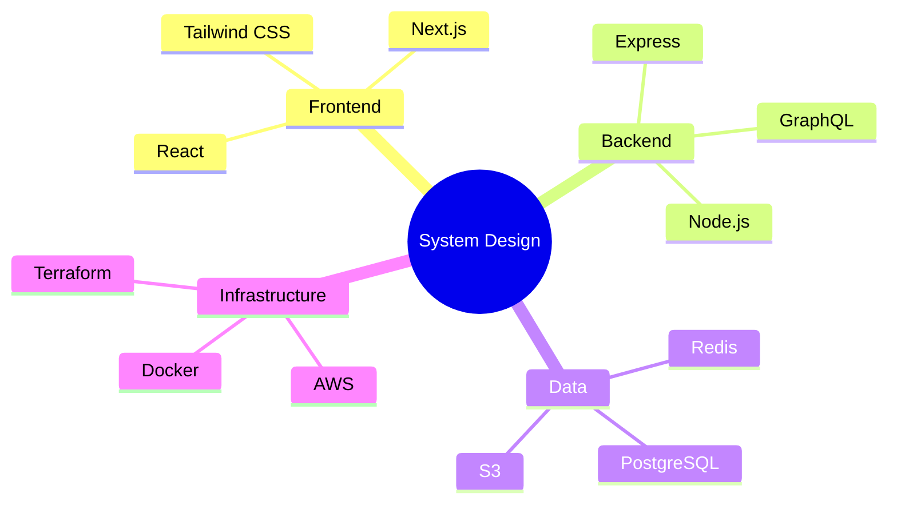
````

## Timeline

````markdown
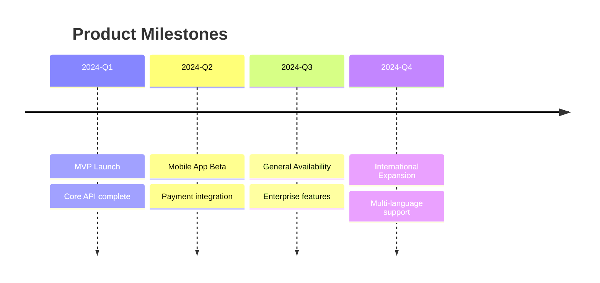
````

## Quadrant Chart

````markdown
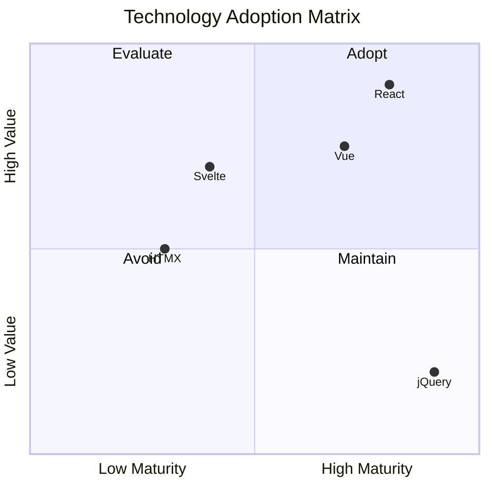
````

## Git Graph

````markdown
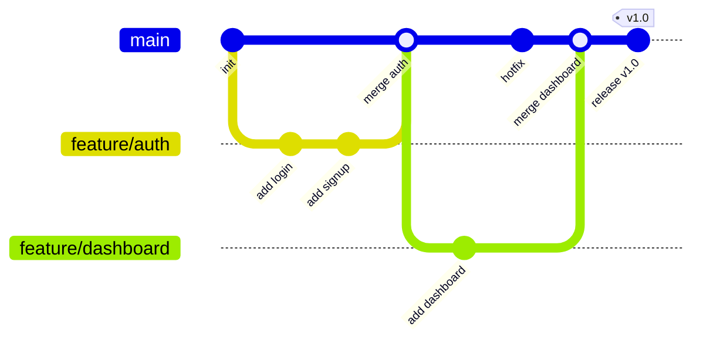
````

## C4 Diagrams in Mermaid

````markdown
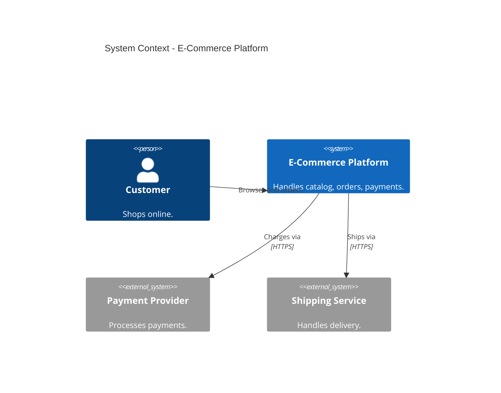
````

## Directives and Themes

### Directives

Directives configure diagram behavior inline. Place them at the top of the diagram block.

````markdown
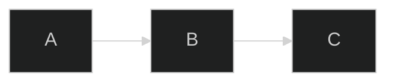
````

### Built-in Themes

| Theme | Description |
|-------|-------------|
| `default` | Standard light theme |
| `dark` | Dark background |
| `forest` | Green-toned |
| `neutral` | Grayscale |
| `base` | Minimal starting point for customization |

### Custom Theme Variables

```
%%{init: {'theme': 'base', 'themeVariables': {
    'primaryColor': '#4C566A',
    'primaryTextColor': '#ECEFF4',
    'primaryBorderColor': '#D8DEE9',
    'lineColor': '#88C0D0',
    'secondaryColor': '#5E81AC',
    'tertiaryColor': '#2E3440'
}}}%%
```

## GitHub / GitLab Rendering

Mermaid diagrams render natively in GitHub and GitLab Markdown. Simply use a fenced code block with the `mermaid` language identifier.

````markdown
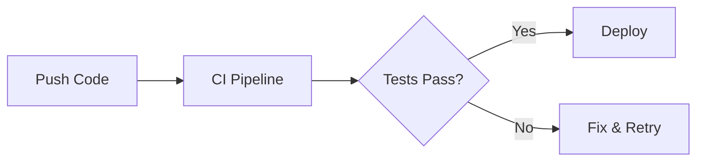
````

This works in:
- README.md and any Markdown file in the repository
- Pull request descriptions and comments
- Issue descriptions and comments
- Wiki pages
- GitHub Discussions

## Configuration via Front Matter

For Markdown files, you can configure Mermaid using YAML front matter:

```yaml
---
config:
  theme: dark
  flowchart:
    curve: basis
---
```

## Best Practices

- **Use Mermaid for documentation-embedded diagrams.** Its native rendering on GitHub and GitLab makes it ideal for READMEs, PRs, ADRs, and wiki pages.
- **Keep diagrams small and focused.** If a diagram has more than 15-20 nodes, split it into multiple diagrams.
- **Choose the right diagram type.** Use flowcharts for processes, sequence diagrams for interactions, class diagrams for structure, ER diagrams for data models.
- **Use subgraphs in flowcharts** to visually group related nodes (e.g., "Frontend", "Backend", "Database Layer").
- **Add labels to all links.** Unlabeled arrows create ambiguity. Always describe what flows along a connection.
- **Use `LR` (left-to-right) for process flows** and `TD` (top-down) for hierarchies.
- **Use aliases for readability.** In sequence diagrams, `participant API as API Server` makes the diagram source easier to read while showing a clean label.
- **Leverage alt/loop/par blocks** in sequence diagrams to show conditional logic, loops, and parallel processing.
- **Test locally before committing.** Use the Mermaid Live Editor (https://mermaid.live) to preview and debug diagrams.
- **Pin the Mermaid version** in documentation sites (Docusaurus, MkDocs) to avoid rendering changes from upstream updates.
- **Use themes consistently** across a project. Set a theme directive at the top of each diagram or configure it globally in your documentation framework.
- **Escape special characters.** Mermaid uses characters like `{}`, `()`, `[]`, `<>` for syntax. Wrap labels containing these in quotes.
