# PlantUML

## Overview

PlantUML is an open-source tool that renders UML diagrams from a plain text description language. Diagrams are defined between `@startuml` and `@enduml` tags. PlantUML supports all major UML diagram types plus additional diagrams like network diagrams, Gantt charts, and mind maps. It integrates with IDEs, CI pipelines, and documentation tools, and can generate PNG, SVG, EPS, and ASCII art output.

## Sequence Diagram

The most commonly used PlantUML diagram type. Models the time-ordered exchange of messages between participants.

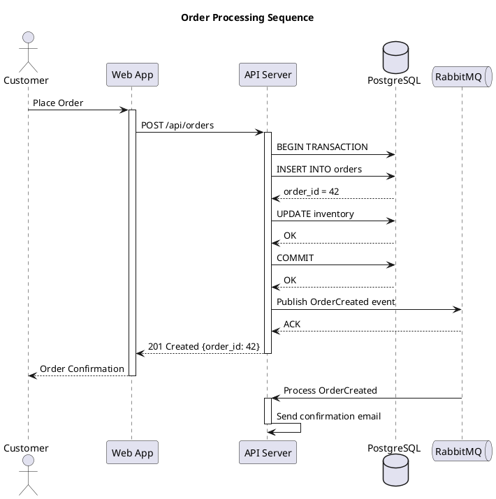

### Participant Types

| Keyword | Shape |
|---------|-------|
| `participant` | Rectangle (default) |
| `actor` | Stick figure |
| `boundary` | Boundary symbol |
| `control` | Control symbol |
| `entity` | Entity symbol |
| `database` | Cylinder |
| `collections` | Stacked rectangles |
| `queue` | Queue symbol |

### Arrow Types

| Syntax | Description |
|--------|-------------|
| `->` | Solid line, solid arrowhead |
| `-->` | Dashed line, solid arrowhead |
| `->>` | Solid line, thin arrowhead |
| `-->>` | Dashed line, thin arrowhead |
| `-\` | Solid line, upper half arrowhead |
| `-/` | Solid line, lower half arrowhead |
| `->x` | Solid line with lost message |
| `-[#red]>` | Colored arrow |

### Grouping and Fragments

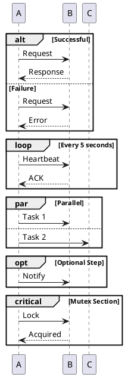

## Class Diagram

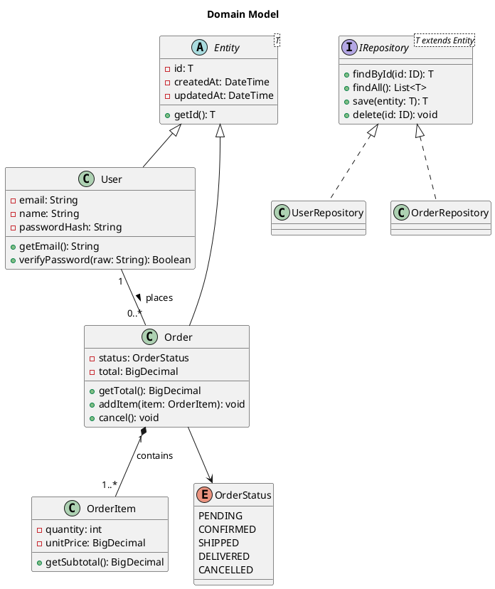

### Relationship Syntax

| Syntax | Meaning |
|--------|---------|
| `A <\|-- B` | B extends A (inheritance) |
| `A <\|.. B` | B implements A (realization) |
| `A *-- B` | A is composed of B (composition) |
| `A o-- B` | A aggregates B (aggregation) |
| `A --> B` | A depends on / uses B (directed association) |
| `A -- B` | Association |
| `A ..> B` | Dependency |
| `A -- "label" B` | Association with label |
| `A "1" -- "0..*" B` | Association with multiplicity |

### Visibility Modifiers

| Symbol | Visibility |
|--------|-----------|
| `+` | Public |
| `-` | Private |
| `#` | Protected |
| `~` | Package |
| `{abstract}` | Abstract method |
| `{static}` | Static member |

## Activity Diagram

PlantUML supports both legacy and modern (beta) activity diagram syntax. The modern syntax is recommended.

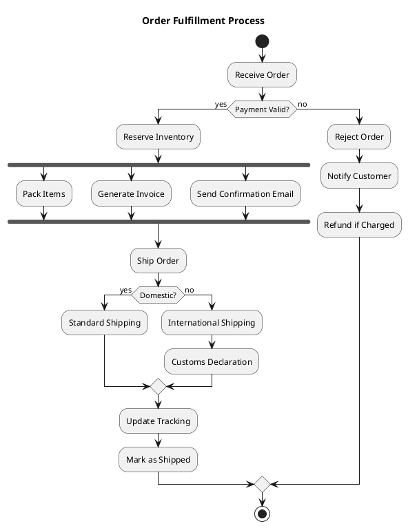

### Activity Diagram Elements

| Syntax | Meaning |
|--------|---------|
| `start` | Start node |
| `stop` | Stop node (success) |
| `end` | End node (termination) |
| `:Action;` | Action / activity step |
| `if (cond) then (yes) ... else (no) ... endif` | Decision |
| `fork ... fork again ... end fork` | Parallel execution |
| `while (cond?) is (yes) ... endwhile (no)` | Loop |
| `repeat ... repeat while (cond?)` | Do-while loop |
| `\|swimlane\|` | Swimlane / partition |
| `#color:Action;` | Colored action |

### Swimlanes

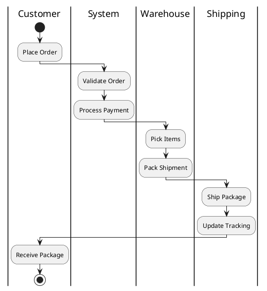

## Component Diagram

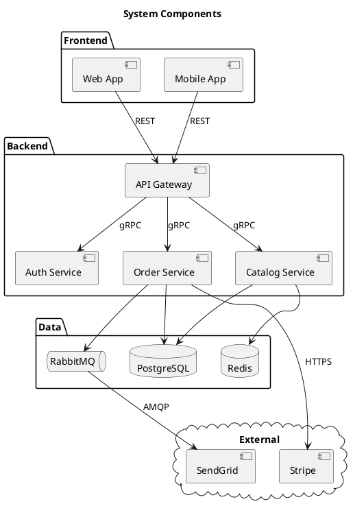

## State Diagram

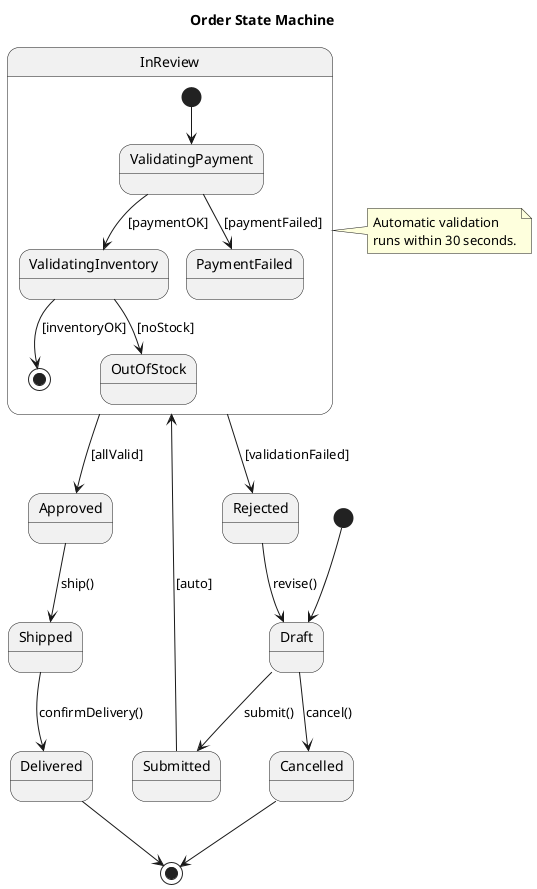

## Use Case Diagram

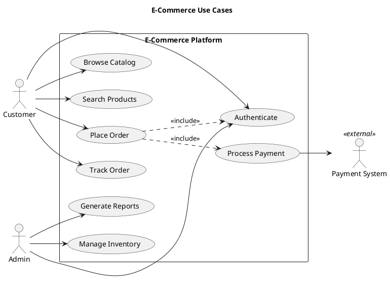

## Object Diagram

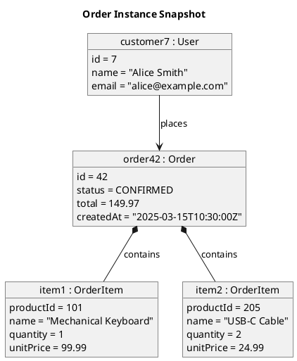

## Deployment Diagram

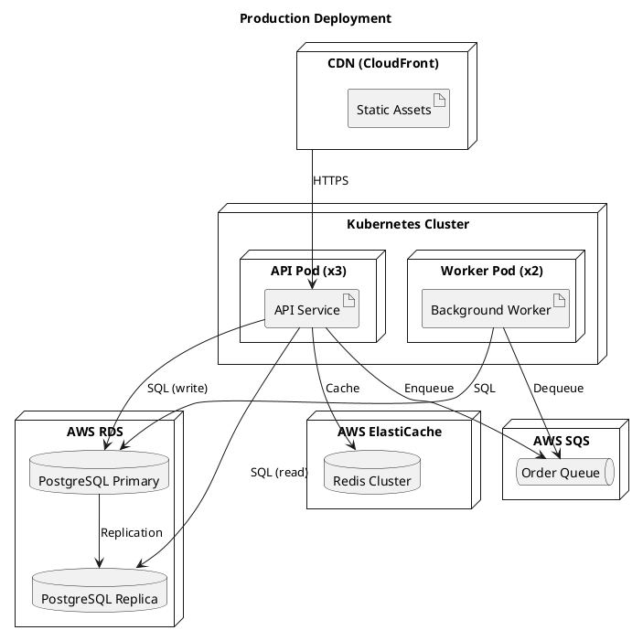

## Skinparam and Theming

### Skinparam

`skinparam` controls the visual appearance of all diagram elements.

```plantuml
@startuml

skinparam backgroundColor #2E3440
skinparam defaultFontColor #ECEFF4
skinparam defaultFontName "Segoe UI"
skinparam defaultFontSize 12

skinparam class {
    BackgroundColor #4C566A
    BorderColor #D8DEE9
    FontColor #ECEFF4
    ArrowColor #88C0D0
    StereotypeFontColor #81A1C1
}

skinparam note {
    BackgroundColor #3B4252
    BorderColor #4C566A
    FontColor #ECEFF4
}

skinparam package {
    BackgroundColor #3B4252
    BorderColor #4C566A
    FontColor #D8DEE9
}

class User {
    + name: String
    + email: String
}

class Order {
    + total: Decimal
    + status: Status
}

User --> Order

@enduml
```

### Common Skinparam Properties

| Property | Description |
|----------|-------------|
| `BackgroundColor` | Shape fill color |
| `BorderColor` | Shape border color |
| `FontColor` | Text color |
| `FontSize` | Text size |
| `FontName` | Font family |
| `ArrowColor` | Connection line color |
| `ArrowThickness` | Connection line width |
| `Shadowing` | true/false for drop shadows |
| `RoundCorner` | Border radius in pixels |
| `Padding` | Internal padding |
| `Margin` | External margin |

### Built-in Themes

PlantUML includes built-in themes that can be applied with a single directive.

```plantuml
@startuml
!theme cerulean
' Other themes: amiga, blueprint, cerulean, crt-amber, crt-green,
' cyborg, hacker, lightgray, mars, materia, metal, minty, plain,
' reddress, sandstone, silver, sketchy-outline, spacelab, superhero,
' toy, united, vibrant

class Example {
    + field: Type
}

@enduml
```

## Includes and File Organization

### !include Directive

```plantuml
@startuml
' Include from a local file
!include common-styles.puml
!include domain/user.puml
!include domain/order.puml

' Include from a URL
!include https://raw.githubusercontent.com/plantuml-stdlib/C4-PlantUML/master/C4_Container.puml

User --> Order

@enduml
```

### Defining Reusable Fragments

**common-styles.puml:**
```plantuml
skinparam class {
    BackgroundColor #4C566A
    BorderColor #D8DEE9
    FontColor #ECEFF4
}

skinparam defaultFontName "Segoe UI"
```

**domain/user.puml:**
```plantuml
class User {
    - id: Long
    - email: String
    - name: String
    + getEmail(): String
}
```

## Preprocessing Directives

PlantUML includes a preprocessor with variables, conditionals, loops, and functions.

### Variables

```plantuml
@startuml
!$primary_color = "#5E81AC"
!$font_color = "#ECEFF4"
!$bg_color = "#2E3440"

skinparam backgroundColor $bg_color
skinparam class {
    BackgroundColor $primary_color
    FontColor $font_color
}

class Example {
    + field: Type
}

@enduml
```

### Conditionals

```plantuml
@startuml
!$env = "production"

!if ($env == "production")
    skinparam backgroundColor #2E3440
    skinparam defaultFontColor #ECEFF4
!else
    skinparam backgroundColor White
    skinparam defaultFontColor Black
!endif

class Config {
    + env: String
}

@enduml
```

### Procedures (Macros)

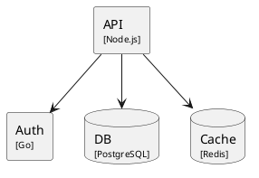

### Loops

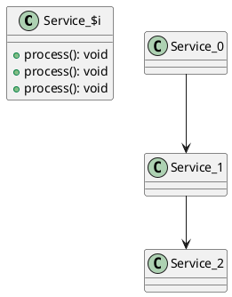

## C4-PlantUML Library

The C4-PlantUML library provides macros for creating C4 model diagrams using PlantUML.

### Installation

Include the library from GitHub or a local copy:

```plantuml
@startuml
!include https://raw.githubusercontent.com/plantuml-stdlib/C4-PlantUML/master/C4_Context.puml
' or for container diagrams:
' !include https://raw.githubusercontent.com/plantuml-stdlib/C4-PlantUML/master/C4_Container.puml
' or for component diagrams:
' !include https://raw.githubusercontent.com/plantuml-stdlib/C4-PlantUML/master/C4_Component.puml
@enduml
```

### C4 Context Diagram

```plantuml
@startuml
!include https://raw.githubusercontent.com/plantuml-stdlib/C4-PlantUML/master/C4_Context.puml

LAYOUT_WITH_LEGEND()

title System Context Diagram

Person(customer, "Customer", "A user who shops online.")
System(ecommerce, "E-Commerce Platform", "Handles catalog, orders, and payments.")
System_Ext(payment, "Payment Provider", "Processes credit card transactions.")
System_Ext(email, "Email Service", "Sends transactional emails.")

Rel(customer, ecommerce, "Browses and purchases", "HTTPS")
Rel(ecommerce, payment, "Processes payments", "HTTPS")
Rel(ecommerce, email, "Sends notifications", "SMTP")

@enduml
```

### C4 Container Diagram

```plantuml
@startuml
!include https://raw.githubusercontent.com/plantuml-stdlib/C4-PlantUML/master/C4_Container.puml

LAYOUT_WITH_LEGEND()

title Container Diagram - E-Commerce Platform

Person(customer, "Customer")

System_Boundary(ecommerce, "E-Commerce Platform") {
    Container(webapp, "Web Application", "Next.js", "Serves the storefront UI.")
    Container(api, "API Service", "Node.js / Express", "Handles business logic and API endpoints.")
    Container(worker, "Background Worker", "Node.js", "Processes async tasks.")
    ContainerDb(db, "Database", "PostgreSQL", "Stores users, orders, products.")
    ContainerQueue(queue, "Message Queue", "RabbitMQ", "Async event processing.")
    Container(cache, "Cache", "Redis", "Session and data caching.")
}

System_Ext(payment, "Stripe", "Payment processing.")

Rel(customer, webapp, "Browses", "HTTPS")
Rel(webapp, api, "API calls", "HTTPS/JSON")
Rel(api, db, "Reads/Writes", "SQL")
Rel(api, cache, "Reads/Writes", "Redis Protocol")
Rel(api, queue, "Publishes events", "AMQP")
Rel(worker, queue, "Consumes events", "AMQP")
Rel(worker, db, "Reads/Writes", "SQL")
Rel(api, payment, "Charges", "HTTPS")

@enduml
```

### C4-PlantUML Macros

| Macro | Purpose |
|-------|---------|
| `Person(alias, label, description)` | Human user |
| `Person_Ext(alias, label, description)` | External human user |
| `System(alias, label, description)` | Software system in scope |
| `System_Ext(alias, label, description)` | External software system |
| `System_Boundary(alias, label)` | System boundary for container views |
| `Container(alias, label, technology, description)` | Container (app, service) |
| `ContainerDb(alias, label, technology, description)` | Database container |
| `ContainerQueue(alias, label, technology, description)` | Message queue container |
| `Component(alias, label, technology, description)` | Component inside a container |
| `Rel(from, to, label, technology)` | Relationship |
| `Rel_D(from, to, label)` | Relationship (downward) |
| `Rel_U(from, to, label)` | Relationship (upward) |
| `Rel_L(from, to, label)` | Relationship (leftward) |
| `Rel_R(from, to, label)` | Relationship (rightward) |
| `LAYOUT_WITH_LEGEND()` | Show legend with color meanings |
| `LAYOUT_TOP_DOWN()` | Top-to-bottom layout |
| `LAYOUT_LEFT_RIGHT()` | Left-to-right layout |

## Running PlantUML

### Command Line

```bash
# Generate PNG from a .puml file
java -jar plantuml.jar diagram.puml

# Generate SVG
java -jar plantuml.jar -tsvg diagram.puml

# Generate all diagrams in a directory
java -jar plantuml.jar -tsvg -o output/ src/diagrams/

# Generate from stdin
echo "@startuml\nA -> B\n@enduml" | java -jar plantuml.jar -pipe > diagram.png

# Use a config file for shared skinparam settings
java -jar plantuml.jar -config style.puml diagram.puml
```

### Docker

```bash
# Run PlantUML server
docker run -d -p 8080:8080 plantuml/plantuml-server:tomcat

# Generate via Docker (no local Java needed)
docker run --rm -v $(pwd):/data plantuml/plantuml -tsvg /data/diagram.puml
```

### IDE Integration

- **VS Code:** "PlantUML" extension by jebbs — provides syntax highlighting, live preview, and export.
- **IntelliJ IDEA:** Built-in PlantUML support via the PlantUML Integration plugin.
- **Confluence:** PlantUML plugin renders diagrams inline.

## Best Practices

- **Use `@startuml` / `@enduml` blocks.** Every PlantUML diagram must be wrapped in these tags. The optional name after `@startuml` becomes the output filename.
- **Organize with `!include`.** Split large models into separate `.puml` files per domain concept and compose them with includes.
- **Use skinparam for consistent styling.** Define a shared style file and `!include` it in every diagram for visual consistency.
- **Use built-in themes** for quick, professional styling. `!theme cerulean` or `!theme blueprint` are good defaults.
- **Leverage the preprocessor.** Use variables for colors, procedures for reusable shapes, and conditionals for environment-specific rendering.
- **Use C4-PlantUML for architecture diagrams.** The C4-PlantUML library provides well-designed macros that produce clean, standardized C4 diagrams.
- **Use aliases for readability.** `participant "API Server" as API` makes source readable while producing clean output.
- **Keep sequence diagrams focused.** If a sequence diagram has more than 7-8 participants or 20+ messages, split it into multiple diagrams with `ref` fragments.
- **Use `left to right direction`** in use case and component diagrams to improve readability for systems with many elements.
- **Generate SVG for documentation.** SVG scales better than PNG and is searchable. Use `-tsvg` in CI pipelines.
- **Integrate with CI.** Add PlantUML rendering to your CI pipeline so diagrams are always up-to-date. Docker-based rendering avoids Java dependency issues.
- **Use the PlantUML server** for team environments. A shared server provides consistent rendering and can be used as a rendering service for documentation platforms.
