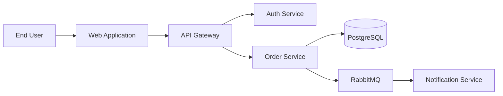
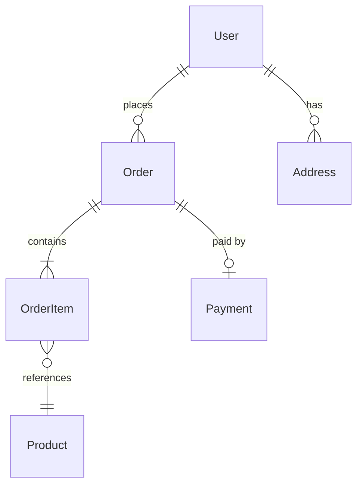

# Technical Requirements Document (TRD)

## Overview
A Technical Requirements Document (TRD) defines *how* a system or feature will be built. It translates the product requirements from the PRD into concrete technical specifications -- architecture, APIs, data models, security controls, performance targets, and deployment strategy. The TRD is the engineering team's blueprint for implementation.

The TRD sits downstream of the PRD and upstream of implementation:
```
PRD ("What are we building?") --> TRD ("How do we build it?") --> Implementation + ADRs
```

## Standard TRD Structure

### 1. Title and Metadata
Document identification, ownership, and status tracking.

### 2. System Overview
High-level description of the system, its purpose, and how it fits into the broader architecture.

### 3. Architecture
System architecture including components, interactions, technology stack, and diagrams.

### 4. API Specifications
Endpoints, request/response schemas, authentication, error handling, and versioning.

### 5. Data Models
Database schema, entity relationships, data types, constraints, and migration strategy.

### 6. Security Requirements
Authentication, authorization, encryption, compliance, and threat model.

### 7. Performance Requirements
Latency, throughput, availability, and scalability targets.

### 8. Dependencies
External services, libraries, infrastructure, and team dependencies.

### 9. Technical Constraints
Technology mandates, backward compatibility, regulatory, and organizational constraints.

### 10. Deployment Plan
Environments, CI/CD pipeline, rollout strategy, and rollback procedures.

## Complete TRD Template

```markdown
# TRD: [System/Feature Name]

| Field            | Value                          |
|------------------|--------------------------------|
| Author           | [Name]                         |
| Status           | Draft / In Review / Approved   |
| Created          | YYYY-MM-DD                     |
| Last Updated     | YYYY-MM-DD                     |
| PRD Reference    | [Link to PRD]                  |
| Reviewers        | [Names]                        |
| Approvers        | [Names]                        |

## 1. System Overview

### 1.1 Purpose
[Brief description of what this system does and why it exists.
Reference the PRD for product context.]

### 1.2 Scope
[What is covered by this TRD. What is explicitly excluded.]

### 1.3 Context
[How this system fits into the broader architecture.
Include a C4 Context diagram or equivalent.]



## 2. Architecture

### 2.1 Architecture Style
[Monolith / Microservices / Serverless / Event-driven / Hybrid]
[Justification for the chosen approach. Link to ADR if applicable.]

### 2.2 Component Overview

| Component           | Responsibility                        | Technology       |
|---------------------|---------------------------------------|------------------|
| API Gateway         | Request routing, rate limiting, auth   | [e.g., Kong]     |
| Auth Service        | Authentication, token management       | [e.g., .NET 8]   |
| Order Service       | Order lifecycle management             | [e.g., .NET 8]   |
| Notification Service| Email, SMS, push notifications         | [e.g., Node.js]  |
| Database            | Persistent data storage                | [e.g., PostgreSQL]|
| Message Queue       | Async event processing                 | [e.g., RabbitMQ] |

### 2.3 Technology Stack

| Layer          | Technology                        | Version     |
|----------------|-----------------------------------|-------------|
| Frontend       | [e.g., React, Blazor]            | [version]   |
| Backend API    | [e.g., ASP.NET Core, Express]    | [version]   |
| Database       | [e.g., PostgreSQL, SQL Server]   | [version]   |
| Cache          | [e.g., Redis]                    | [version]   |
| Message Broker | [e.g., RabbitMQ, Kafka]          | [version]   |
| Hosting        | [e.g., Azure AKS, AWS ECS]      | N/A         |

### 2.4 Communication Patterns

| From              | To                  | Protocol   | Pattern     |
|-------------------|---------------------|------------|-------------|
| Web App           | API Gateway         | HTTPS      | Synchronous |
| API Gateway       | Auth Service        | gRPC       | Synchronous |
| API Gateway       | Order Service       | HTTPS/REST | Synchronous |
| Order Service     | Notification Service| AMQP       | Async (event)|

## 3. API Specifications

### 3.1 API Design Principles
[REST / GraphQL / gRPC. Versioning strategy. Naming conventions.]

### 3.2 Authentication and Authorization
[OAuth 2.0, JWT, API keys. Token format and validation. Scope/role model.]

### 3.3 Endpoints

#### POST /api/v1/orders
**Description:** Create a new order
**Authentication:** Bearer token (JWT)
**Authorization:** Role: `customer`

**Request:**
```json
{
  "items": [
    {
      "productId": "WM001",
      "quantity": 2
    }
  ],
  "shippingAddress": {
    "street": "123 Main St",
    "city": "Springfield",
    "state": "IL",
    "zip": "62701"
  },
  "paymentMethodId": "pm_abc123"
}
```

**Response (201 Created):**
```json
{
  "orderId": "ord_789xyz",
  "status": "pending",
  "total": 59.98,
  "currency": "USD",
  "estimatedDelivery": "2025-02-15",
  "createdAt": "2025-02-08T14:30:00Z"
}
```

**Error Responses:**

| Status | Code               | Description                     |
|--------|--------------------|---------------------------------|
| 400    | INVALID_REQUEST    | Missing or malformed fields     |
| 401    | UNAUTHORIZED       | Invalid or expired token        |
| 403    | FORBIDDEN          | Insufficient permissions        |
| 409    | OUT_OF_STOCK       | Requested quantity unavailable  |
| 422    | VALIDATION_ERROR   | Business rule violation         |
| 500    | INTERNAL_ERROR     | Unexpected server error         |

### 3.4 Rate Limiting
[Requests per minute per user/IP. Rate limit headers. Retry-After behavior.]

### 3.5 Pagination
[Cursor-based / offset-based. Page size limits. Response envelope format.]

## 4. Data Models

### 4.1 Entity-Relationship Diagram



### 4.2 Schema Definitions

#### Users Table
| Column       | Type         | Constraints           | Description           |
|--------------|--------------|-----------------------|-----------------------|
| id           | UUID         | PK                    | Unique identifier     |
| email        | VARCHAR(255) | UNIQUE, NOT NULL      | Login email           |
| password_hash| VARCHAR(255) | NOT NULL              | Bcrypt hash           |
| created_at   | TIMESTAMPTZ  | NOT NULL, DEFAULT NOW | Account creation time |
| updated_at   | TIMESTAMPTZ  | NOT NULL              | Last modification     |

#### Orders Table
| Column       | Type         | Constraints           | Description           |
|--------------|--------------|-----------------------|-----------------------|
| id           | UUID         | PK                    | Unique identifier     |
| user_id      | UUID         | FK -> Users(id)       | Customer reference    |
| status       | VARCHAR(50)  | NOT NULL              | Order status enum     |
| total        | DECIMAL(10,2)| NOT NULL              | Order total amount    |
| currency     | CHAR(3)      | NOT NULL, DEFAULT 'USD'| ISO 4217 currency   |
| created_at   | TIMESTAMPTZ  | NOT NULL, DEFAULT NOW | Order creation time   |

### 4.3 Data Migration Strategy
[How schema changes are applied. Tool (e.g., Flyway, EF Migrations).
Backward compatibility during rolling deployments.]

### 4.4 Data Retention and Archival
[Retention policies. PII handling. Archival strategy for historical data.]

## 5. Security Requirements

### 5.1 Authentication
[Mechanism: OAuth 2.0 + PKCE, JWT tokens, session management.
Token lifetime and refresh strategy.]

### 5.2 Authorization
[RBAC / ABAC model. Role definitions. Permission matrix.]

| Role     | Create Order | View Orders | Cancel Order | Admin Panel |
|----------|-------------|-------------|--------------|-------------|
| Customer | Yes         | Own only    | Own (pending)| No          |
| Support  | No          | All         | All          | No          |
| Admin    | Yes         | All         | All          | Yes         |

### 5.3 Data Protection
[Encryption at rest (AES-256). Encryption in transit (TLS 1.2+).
PII handling. GDPR/CCPA compliance measures.]

### 5.4 Input Validation
[Validation strategy. Sanitization. SQL injection prevention.
XSS prevention. CSRF protection.]

### 5.5 Secrets Management
[Vault / Key Vault / SSM. Secret rotation policy.
No secrets in code or environment files.]

### 5.6 Audit Logging
[What is logged. Log retention. Tamper-proof storage.]

## 6. Performance Requirements

### 6.1 Latency Targets

| Operation        | P50 Target | P95 Target | P99 Target |
|------------------|-----------|-----------|-----------|
| API response     | < 100ms   | < 300ms   | < 1s      |
| Page load (FCP)  | < 1.5s    | < 3s      | < 5s      |
| Search results   | < 200ms   | < 500ms   | < 2s      |
| Order placement  | < 500ms   | < 1s      | < 3s      |

### 6.2 Throughput
[Expected RPS. Peak load projections. Burst capacity.]

### 6.3 Availability
[SLA target (e.g., 99.9%). Planned maintenance windows.
Failover strategy. RTO and RPO.]

### 6.4 Scalability
[Horizontal vs vertical scaling strategy.
Auto-scaling triggers and limits.
Database read replicas / sharding plan.]

### 6.5 Caching Strategy
[Cache layers (CDN, application cache, database cache).
Cache invalidation strategy. TTL policies.]

## 7. Dependencies

### 7.1 External Services
| Service             | Purpose            | SLA    | Fallback Strategy     |
|---------------------|--------------------|--------|-----------------------|
| [Payment Provider]  | Payment processing | 99.95% | Queue and retry       |
| [Email Provider]    | Transactional email| 99.9%  | Fallback provider     |
| [CDN Provider]      | Static asset delivery| 99.99%| Origin fallback      |

### 7.2 Internal Dependencies
[Other team services, shared libraries, platform services.]

### 7.3 Third-Party Libraries
[Key libraries with versions. License compliance. Update strategy.]

## 8. Technical Constraints

- [Constraint 1: e.g., Must run on .NET 8 LTS]
- [Constraint 2: e.g., Must use PostgreSQL (organizational standard)]
- [Constraint 3: e.g., Must support IE 11 (legacy customer requirement)]
- [Constraint 4: e.g., Must integrate with existing SSO via SAML 2.0]
- [Constraint 5: e.g., Maximum deployment artifact size 500MB]

## 9. Deployment Plan

### 9.1 Environments
| Environment | Purpose              | URL                        |
|-------------|----------------------|----------------------------|
| Development | Active development   | dev.example.internal       |
| Staging     | Pre-production testing| staging.example.internal   |
| Production  | Live traffic         | api.example.com            |

### 9.2 CI/CD Pipeline
[Build → Test → Security Scan → Deploy → Smoke Test → Rollout]
[Tool: GitHub Actions / Azure DevOps / Jenkins]

### 9.3 Rollout Strategy
[Blue-green / Canary / Rolling update.
Canary percentage and promotion criteria.
Feature flags for gradual rollout.]

### 9.4 Rollback Plan
[Automated rollback triggers (error rate, latency).
Manual rollback procedure.
Database rollback strategy (backward-compatible migrations).]

### 9.5 Monitoring and Alerting
[Metrics: latency, error rate, CPU, memory, queue depth.
Tools: Prometheus, Grafana, Datadog, Azure Monitor.
Alert thresholds and escalation policy.]

## 10. Open Technical Questions

- [ ] [Question 1 -- owner, target date]
- [ ] [Question 2 -- owner, target date]
- [ ] [Question 3 -- owner, target date]

## Appendix

### A. Glossary
[Domain-specific technical terms and acronyms.]

### B. Related Documents
- PRD: [link]
- ADRs: [links to relevant architecture decisions]
- API Schema: [link to OpenAPI/Swagger spec]
- Runbook: [link to operational runbook]
```

## TRD Example: Order Service

```markdown
# TRD: Order Service

| Field            | Value                     |
|------------------|---------------------------|
| Author           | Jane Engineer             |
| Status           | In Review                 |
| Created          | 2025-01-15                |
| PRD Reference    | PRD-042: Checkout Redesign|

## 1. System Overview

The Order Service manages the complete order lifecycle from creation
through fulfillment. It replaces the order module in the monolith
as part of the microservices migration (see ADR-007).

## 2. Architecture

Architecture style: Event-driven microservice (see ADR-012).

The service exposes a REST API for synchronous order operations
and publishes domain events to RabbitMQ for downstream consumers
(notification, analytics, fulfillment).

## 3. Key API Endpoints

- POST /api/v1/orders -- Create order
- GET /api/v1/orders/{id} -- Get order by ID
- GET /api/v1/orders?userId={id} -- List user orders
- PATCH /api/v1/orders/{id}/cancel -- Cancel order
- POST /api/v1/orders/{id}/refund -- Initiate refund

## 4. Data Model

Orders table with OrderItems join table. Uses PostgreSQL with
EF Core migrations. See schema definitions in Section 4.2 above.

## 5. Events Published

| Event              | Trigger               | Consumers                  |
|--------------------|-----------------------|----------------------------|
| OrderCreated       | New order placed      | Notification, Analytics    |
| OrderCancelled     | Order cancelled       | Notification, Fulfillment  |
| OrderFulfilled     | Order shipped         | Notification, Analytics    |
| PaymentProcessed   | Payment confirmed     | Order (self), Analytics    |
```

## Relationship to Other Documents

```
BRD (Business Requirements)
 |  Business case and justification
 v
PRD (Product Requirements)
 |  What to build, user stories, success metrics
 v
TRD (Technical Requirements)  <-- YOU ARE HERE
 |  How to build it -- architecture, APIs, data, deployment
 |
 +---> ADR (Architecture Decision Records)
 |     Individual decisions made during TRD creation
 |     (e.g., "Why PostgreSQL over MongoDB?")
 |
 +---> RFC (Request for Comments)
 |     Proposals for significant technical changes
 |     that need team-wide input before finalizing
 |
 v
Implementation
 |  Code guided by the TRD
 v
Gherkin / Gauge (Executable Specs)
    Verification that implementation meets requirements
```

## Best Practices

- **Reference the PRD** -- every technical decision should trace back to a product requirement. If a TRD section cannot be justified by the PRD, question whether it belongs.
- **Include diagrams** -- architecture diagrams (C4, sequence, ERD) communicate structure far better than prose alone. Use Mermaid for Markdown-native rendering.
- **Specify API contracts precisely** -- include request/response schemas, error codes, authentication, pagination, and rate limiting. Consider providing an OpenAPI spec as an appendix.
- **Define performance targets with percentiles** -- P50, P95, and P99 targets are more useful than averages, which hide tail latency.
- **Document the security model explicitly** -- authentication, authorization, encryption, input validation, and secrets management deserve dedicated sections, not afterthoughts.
- **Plan for failure** -- include rollback procedures, circuit breaker strategies, fallback behaviors, and disaster recovery in the deployment plan.
- **Record decisions as ADRs** -- when the TRD makes a significant technical choice (database, framework, architecture style), create a linked ADR to capture the context and trade-offs.
- **Keep it current** -- update the TRD as the system evolves. An outdated TRD is a liability, not an asset.
- **Review with the full engineering team** -- the TRD should be reviewed by backend, frontend, infrastructure, security, and QA engineers before implementation begins.
- **Use version control** -- store the TRD in the repository alongside the code it describes so it evolves with the system.
